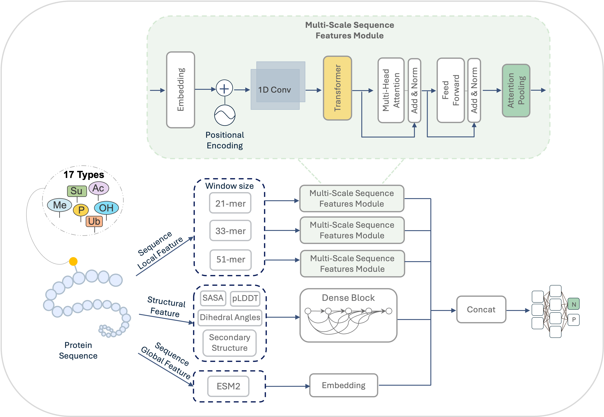

# DeepPTMPred

DeepPTMPred is a deep learning-based framework for predicting post translational modifications sites, capable of identifying various modification types, including phosphorylation, acetylation, ubiquitination, and etc. 
 


***
### Key Function
- Multi-type PTM prediction – supports 16 types of modifications
- Hybrid model architecture – combining Transformer and CNN
- Integration of the ESM-2 protein language model
- Incorporation of structural features – including secondary structure, solvent accessibility, etc.
- Support for imbalanced datasets

***
### System Requirements
GPU: NVIDIA CUDA 11.8+ (recommended) Memory: 16 GB+ Storage: At least 50 GB of free disk space

***
### Setup of DeepPTMPred

Install DeepPTMPred: 

```shell
git clone https://github.com/kuikui-wang/DeepPTMPred.git
cd DeepPTMPred/pred/train_PTM
conda env create -f environment.yml
conda activate ptm-env
```


***

### Requirements

Please download the required files before running the prediction.

| Link                                                                                                          | Path                |
| ------------------------------------------------------------------------------------------------------------- | ------------------- |
| [ptm_data.csv](https://drive.google.com/file/d/1sBSODTVUOm3Q7wa05fFmupYiQs072nKX/view?usp=drive_link)         | DeepPTMPred/data    |
| [ptm_data_esm_features.npy](https://drive.google.com/file/d/1wJgUQ861iqM3CXJJoQb6AT_jWT-2Dedi/view?usp=drive_link) | DeepPTMPred/pred    |
| [esm model](https://drive.google.com/drive/folders/1KYbfh3PGRhd_s0wn-8tZcbX_uvo1xdNm?usp=drive_link)   | DeepPTMPred         |


***
### Train

1. Supported PTM types include:
 - phosphorylation            
 - acetylation                
 - ubiquitination             
 - hydroxylation              
 - gamma_carboxyglutamic_acid 
 - lys_methylation            
 - malonylation               
 - arg_methylation            
 - crotonylation              
 - succinylation              
 - glutathionylation          
 - sumoylation                
 - s_nitrosylation            
 - glutarylation              
 - citrullination             
 - o_linked_glycosylation     
 - n_linked_glycosylation     


2. Train:
   ```
   python main.py 
   ```


***
### Demo

1. Get predictions for the tau protein:

   ```python
   python case.py
   ```

***

### Predict

1. Download the ESM model checkpoint files from [esm model](https://drive.google.com/drive/folders/1KYbfh3PGRhd_s0wn-8tZcbX_uvo1xdNm?usp=drive_link) and place in the /DeepPTMPred directory .

2. Data Preparation:

   a. ESM Features:
   
   ```shell
   python e2_single_data.py
   ```  

   b. Structual Features:
   
   Download the corresponding PDB files from AlphaFold DB and place them in DeepPTMPred/data directory


4. Update Configuration
Before running the prediction, you need to configure the following key parameters in predict.py:

    - ptm_type
   
      Specify the type of post-translational modification (PTM) to predict.Supported types include: 'phosphorylation', 'acetylation', 'ubiquitination', etc.
   
      ```shell
      Example: ptm_type = 'phosphorylation'
      ``` 

   - model_path

      Path to the trained model weights file (.h5 ).

      Make sure use the model corresponds to the selected ptm_type.
     
      ```shell
      Example: model_path = "./DeepPTMPred/pred/train_PTM/model/models_phosphorylation_esm2/ptm_data_210_39_64_best_model.h5"
      ``` 
    
   - pdb_path:
   
      File path to the input PDB structure. The script will automatically extract the protein sequence and structural features (e.g., SASA, secondary structure, plDDT) from this file.
   
      Supported formats: AlphaFold-style PDB files (e.g., AF-P31749-F1-model_v4.pdb).
     
      ```shell
      Example: pdb_path = "./DeepPTMPred/data/AF-P31749-F1-model_v4.pdb"
      ``` 


6. Run predictions:
   
   Execute the script to generate predictions:

   ```
   python predict.py 
   ```


